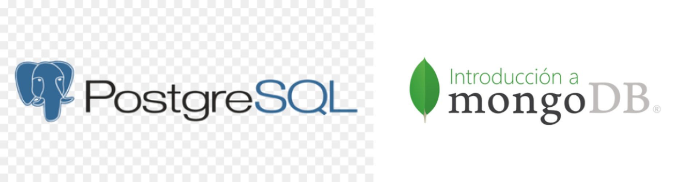
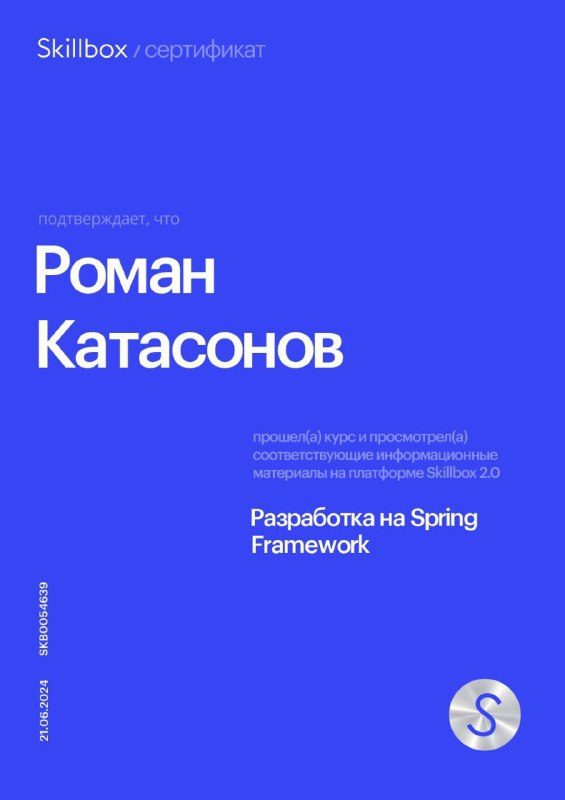

# Курсовая работа «Разработка на Spring Framework»
**Бэкенд-часть сервиса бронирования отелей с панелью управления контентом (CMS)**


## Общее описание
Сервис позволяет управлять отелями, номерами, пользователями и бронированиями через REST API. Администраторы могут редактировать контент через специальную административную панель.

В системе реализовано **событийное логирование** ключевых действий:
- 📥 **Создание нового пользователя** → событие публикуется в топик `user-service`
- 📥 **Создание новой брони** → событие публикуется в топик `booking-service`

Все события автоматически собираются и сохраняются в журнал статистики.  
📊 **Вы можете скачать полный отчёт в формате CSV** по эндпоинту: `GET /statistics/download` → файл `statistics_ГГГГ-ММ-ДД.csv`

---

## Основные сущности

- **Отель** — содержит название, заголовок рекламы, город, адрес, расстояние до центра, рейтинг (1–5) и количество оценок.
- **Номер** — имеет название, описание, номер, цену, максимальное количество гостей и периоды недоступности. Привязан к конкретному отелю.
- **Пользователь** — уникальный логин, email, пароль и роль (`USER` или `ADMIN`).
- **Бронирование** — даты заезда и выезда, ссылка на номер и пользователя.

---

## Возможности

### Отели
- Поиск по ID
- Создание / редактирование / удаление (только администратор)
- Получение списка всех отелей

### Номера
- Поиск по ID
- Создание / редактирование / удаление (только администратор)

### Пользователи и бронирования
- Регистрация нового пользователя (проверка уникальности логина и email)
- Создание бронирования
- Просмотр всех бронирований (только администратор)
### Валидация
- В проекте реализована  кастомная валидация, инкапсулированная в виде  аннотации @CustomValid и подключённая через аспектно-ориентированное программирование (AOP).
- Теперь достаточно пометить метод контроллера этой аннотацией — и все входящие DTO, реализующие интерфейс SchemaValidator, автоматически пройдут бизнес-валидацию без дублирования кода и явных вызовов.
- Это решение обеспечивает:

- ✅ чистоту контроллеров (никакой логики валидации в handler-методах),
- ✅ единый подход ко всем запросам,
- ✅ лёгкую расширяемость — достаточно реализовать validate() в новом DTO,
- ✅ полную скрытность механизма от бизнес-логики — валидация «просто работает».
---

## Безопасность
- Регистрация — без авторизации.
- Управление отелями и номерами — **только для администратора**.
- Просмотр всех бронирований — **только для администратора**.
- Остальные операции — для авторизованных пользователей (включая обычных пользователей и администраторов).

---

## Технологии
- **Java 17**
- **Spring Boot 3.2.3**
- **Spring Security**
- **PostgreSQL** (основные данные)
- **MongoDB** (статистика)
- **Kafka** (событийная шина: `user-service`, `booking-service`)
- **Liquibase** (миграции БД)
- **Docker** (запуск зависимостей)

---

## Запуск проекта

1. Клонируйте репозиторий:
   ```bash
   git clone https://github.com/Katas77
   cd contacts-application
   ```

2. Запустите зависимости через Docker:
   ```bash
   cd docker
   docker-compose up -d
   ```

3. Соберите и запустите приложение:
   ```bash
   mvn clean install
   java -jar target/*.jar
   ```

> ⚠️ Не забудьте указать свои параметры подключения к БД в `application.yml`.

---





---

✉ **Обратная связь**: [krp77@mail.ru](mailto:krp77@mail.ru)
